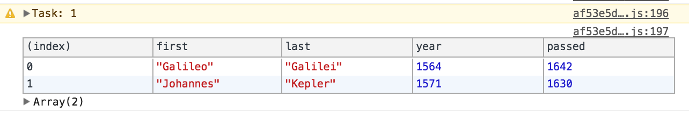

# Exercise 04 - Array Cardio

An exercise focusing on some common array methods.

Tested in Chrome.

## About this exercise ...

It's always good to refresh on the core skills ... and I was pleasantly surprised with the value I got from this exercise and really enjoyed it.

:book: Typings <br/>
:book: Array.prototype.reduce <br/>
:book: console.table <br/>
:book: (bonus) Currying

#### Typings

Another little bit of knowledge picked up here. We were adding properties to the empty object passed to the reducer and I wasn't sure exactly how to write the interface. I found an answer on [Stack Overflow](https://stackoverflow.com/a/30841107) (... where else) where the property is defined in square brackets as follows:

```
export interface ITransport {
	[name: string]: number;
}
```

:thumbsup:

#### Array Reduce

One of the array method I was aware of, but am guilty of either not understanding it completely, or not using it where applicable.

For example:

```
const totalYears: number = inventors.reduce(
	(total: number, inventor: IInventor): number => {
		return total + (inventor.passed - inventor.year);
	}
, 0);
```

Either way, I now have a better understanding moving forward.

#### Console Table

Mind = :collision:

How have I not come across this before i'll never know. I will be using this _all the time_ from now on :gem:

```
console.table(myObject);
```

Gives you:



#### Currying

One of those things I've probably done a thousand times without realising, but the mind must be firing pretty well as I immediately recognised that this would be useful approached writing the function with this in mind.

FWIW I wrote a small function that logs out a block for each task:

```
function logHelper(): (result: any) => any {
	let task: number = 1;
	const log: (result: any) => void = (result: any): void => {
		console.warn(`Task: ${task++}`);
		(typeof result == 'array' || typeof result == 'object') ? console.table(result) : console.log(result);
	};

	return log;
}
```
Unfortunately I'm using 'any' to be typesafe here, and a typed curried function seems like a can of worms ... I need to come back to that.

Not perfect, but was useful enough. :guitar:

## Tooling

Serve:

`npm run exercise-2`

Build:

`npm build exercise-2`
