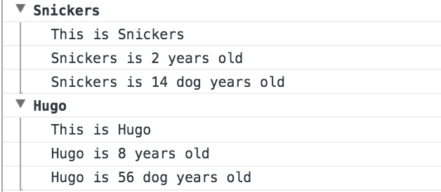
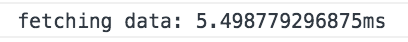

# Exercise 09 - Dev Tools Domination

This exercise show the different methods to log to the console.

Tested in Chrome.

## About this exercise ...

Picked up a few useful tidbits. Not really dev-tools domination, maybe console domination!

:book: Grouping <br/>
:book: Timing

#### Console Grouping

Handy way to group information in the console.

```
dogs.forEach((dog: any): void => {
	console.groupCollapsed(`${dog.name}`);
	console.log(`This is ${dog.name}`);
	console.log(`${dog.name} is ${dog.age} years old`);
	console.log(`${dog.name} is ${dog.age * 7} dog years old`);
	console.groupEnd(`${dog.name}`);
});
```
Will log this in the console:



#### Console Timing

Useful method to time how long a task will take.

```
console.time('fetching data');
    fetch('https://api.github.com/users/bfowler40')
      .then(data => data.json())
      .then(data => {
        console.timeEnd('fetching data');
        console.log(data);
      });
```

Will log this to the console:



All-in-all, pretty handy!! :trumpet:

## Tooling

Serve:

`npm run exercise-9`

Build:

`npm build exercise-9`
